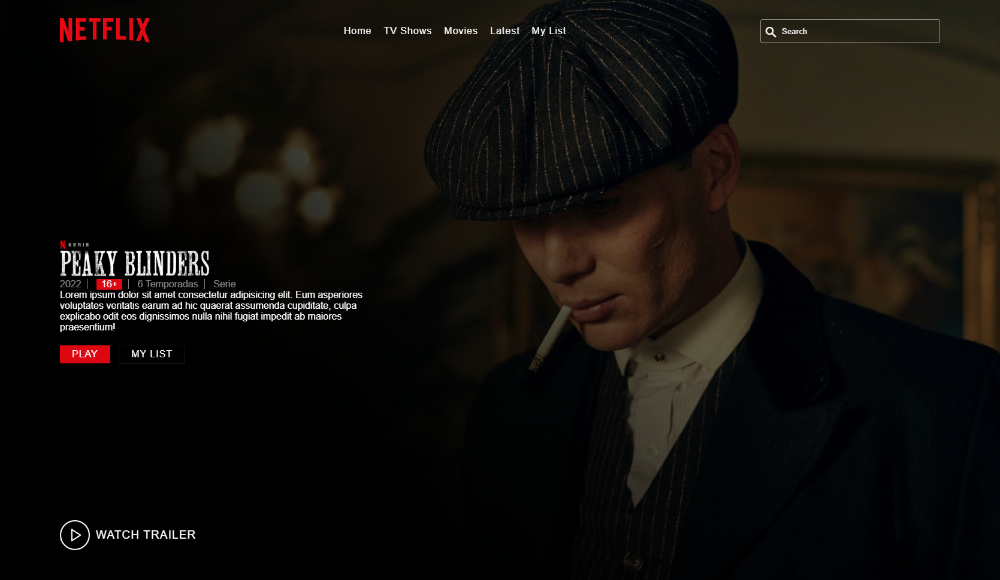

# Netflix Page

This project is about a Netflix Page is made with HTML, CSS, Sass and JavaScript

# Screen Project

## Computer


## Phone
<div align="center">
  
</div>

# Install

```sh
git clone https://github.com/asalinasf/netflix-page/
cd netflix-page
open in your browse
```

# Visit my project with this url

https://netflix-aaronsalinas.netlify.app/
